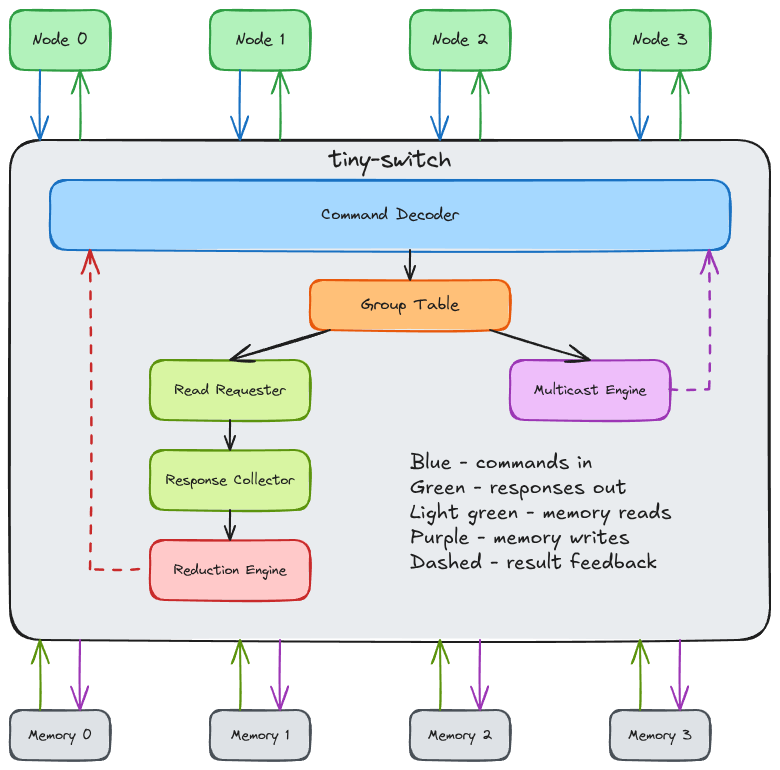

# tiny-switch

A minimal in-network reduction switch implementing SHARP-like functionality. The switch actively pulls data from connected nodes, performs BFloat16 SUM reduction, and returns results.

## Architecture



**Data Flow:**
- **LOAD_REDUCE**: Decoder → Group Table (lookup) → Read Requester → Response Collector → Reduction Engine → Response
- **STORE_MC**: Decoder → Group Table (lookup) → Multicast Engine → Write to nodes → ACK
- **READ**: Decoder → Read Requester → Response Collector → Reduction Engine → Response (single node, skips Group Table)
- **WRITE**: Decoder → Multicast Engine → Write to node → ACK (single node, skips Group Table)

## Features

- **4 Ports**: Connect up to 4 nodes
- **BFloat16 Data**: 16-bit brain floating point format
- **SUM Reduction**: In-network aggregation
- **Multicast**: Broadcast to multiple nodes
- **Pull-based**: Switch actively reads from node memories

## Commands

| Command | Description |
|---------|-------------|
| `LOAD_REDUCE` | Read from all nodes in group, sum, return to requester |
| `STORE_MC` | Write data to all nodes in group (multicast) |
| `READ` | Normal read (passthrough) |
| `WRITE` | Normal write (passthrough) |

## Building

### Prerequisites

- [Icarus Verilog](https://steveicarus.github.io/iverilog/) - Simulation
- [sv2v](https://github.com/zachjs/sv2v) - SystemVerilog to Verilog conversion
- [Verilator](https://www.veripool.org/verilator/) - Linting
- [cocotb](https://www.cocotb.org/) - Python testbench framework
- [verible](https://github.com/chipsalliance/verible) - Formatting (optional)

### Quick Start

#### Python Environment Setup

```bash
# Option 1: Using uv (fast)
uv venv .venv
source .venv/bin/activate
uv pip install -r requirements.txt

# Option 2: Using pip
python -m venv .venv
source .venv/bin/activate
pip install -r requirements.txt
```

#### Running Tests

```bash
# Run all tests
make test

# Run specific test
make test_allreduce
make test_multicast
make test_readwrite

# Lint
make lint

# Format code
make format
```

## Project Structure

```
tiny-switch/
├── src/                      # SystemVerilog source
│   ├── tswitch_pkg.sv        # Shared types and constants
│   ├── tswitch.sv            # Top-level module
│   ├── cmd_decoder.sv        # Command decoder/arbiter
│   ├── group_table.sv        # Multicast address lookup
│   ├── read_requester.sv     # Parallel read issuer
│   ├── response_collector.sv # Response gathering
│   ├── reduction_engine.sv   # SUM accumulator
│   ├── bf16_adder.sv         # BFloat16 adder (NaN/Inf aware)
│   ├── multicast_engine.sv   # Broadcast writer
│   └── parallel_issuer.sv    # Shared parallel request logic
├── test/                     # Python tests (cocotb)
│   ├── test_allreduce.py     # AllReduce test
│   ├── test_multicast.py     # Multicast test
│   ├── test_readwrite.py     # Read/Write passthrough test
│   └── helpers/              # Test utilities
├── Makefile
└── README.md
```

## AllReduce Operation

### Single LOAD_REDUCE Flow

```
1. Node 0 issues: CMD_LOAD_REDUCE, addr=0x10000000

2. Switch looks up group table:
   addr 0x10000000 → Group 0 → {Node0, Node1, Node2, Node3}

3. Switch issues parallel READs to all nodes:
   Switch → Node0: READ 0x10000000
   Switch → Node1: READ 0x10000000
   Switch → Node2: READ 0x10000000
   Switch → Node3: READ 0x10000000

4. Nodes respond with BFloat16 values:
   Node0 → Switch: 1.5
   Node1 → Switch: 2.0
   Node2 → Switch: 0.5
   Node3 → Switch: 1.0

5. Reduction engine computes SUM:
   result = 1.5 + 2.0 + 0.5 + 1.0 = 5.0

6. Switch returns result to Node 0:
   Switch → Node0: RESP_DATA, 5.0
```

### AllReduce Algorithms

For reducing a vector of V elements across N nodes, two algorithms are supported:

#### Oneshot AllReduce

All nodes issue LOAD_REDUCE for all elements. Simple but redundant.

```
For each element [0..V-1]:
  All N nodes issue LOAD_REDUCE → All N nodes receive result

Operations: V × N LOAD_REDUCE
Transfers:  V × N² memory reads (each element reduced N times)
```

#### Two-shot AllReduce (Reduce-Scatter + Allgather)

Each node reduces only its assigned elements, then broadcasts results. More efficient.

```
Phase 1 - Reduce-Scatter:
  Node 0: LOAD_REDUCE elements [0, 1]      ─┐
  Node 1: LOAD_REDUCE elements [2, 3]       │ Each element
  Node 2: LOAD_REDUCE elements [4, 5]       │ reduced ONCE
  Node 3: LOAD_REDUCE elements [6, 7]      ─┘

Phase 2 - Allgather:
  Node 0: STORE_MC elements [0, 1] → all   ─┐
  Node 1: STORE_MC elements [2, 3] → all    │ Broadcast
  Node 2: STORE_MC elements [4, 5] → all    │ results
  Node 3: STORE_MC elements [6, 7] → all   ─┘

Operations: V LOAD_REDUCE + V STORE_MC
Transfers:  V × N reads + V × N writes = 2 × V × N
```

#### Performance Comparison (V=8, N=4)

| Algorithm | Operations | Transfers | Cycles (150cy latency) |
|-----------|------------|-----------|------------------------|
| Oneshot   | 32         | 128 reads | 5,152                  |
| Two-shot  | 16         | 64 total  | 1,352                  |

Two-shot is **O(N)** vs Oneshot's **O(N²)** — the advantage grows with more nodes.


## Performance Testing

Run tests with realistic memory latencies:

```bash
# Functional tests (fast, 2-cycle memory latency)
make test

# Performance tests (150-cycle memory latency)
make perf
```

Set `TEST_MODE` environment variable for custom configurations:
- `functional` (default): Fast functional verification
- `perflink`: High-speed interconnect latencies
- `slow`: Higher latency interconnect

## License

Apache 2.0 - see [LICENSE](LICENSE) for details.

Copyright 2026 Ilya Kryukov (ilyakrukov@gmail.com)
